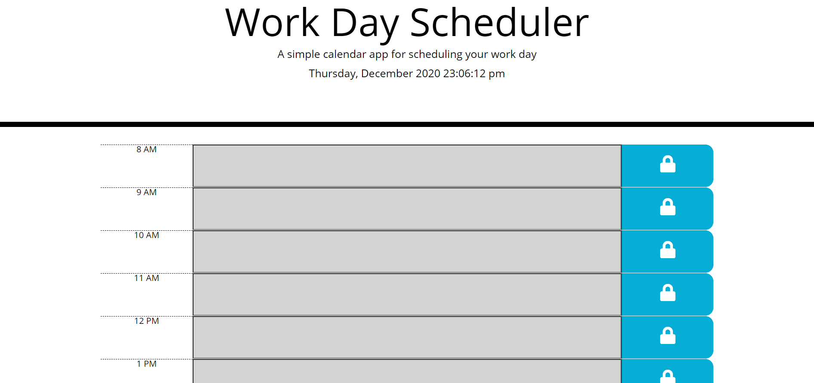

# WorkDay Scheduler

This repository houses the program of a _**workday scheduler**_ completely created through HTML, CSS, and Javascript.  This program resembles one potential example of an American workday (8:00 AM to 5:00 PM) with a up-to-date running clock.

## Preview

Here is a screenshot of the program...

## Using the Scheduler

The _**workday scheduler**_ uses Javascript to dynamically create the website you see when loading up the program.  At the top of the website, you will be able to see the current date, as well as the current time.  Rows are populated which contain the hour, the input field, and the **save** button.  Using the scheduler is rather simple: input what you would like to save in the time block you want and click the save button.  The program will save your input and the time associated with it to localStorage in your browser.  This means, if you ever exit the website or refresh the page, the program will repopulate your saved inputs.

The time blocks also change color dynamically according to the current time:
- Gray for any time blocks that have past
- Red for any current time blocks
- Green for any future time blocks

Here is a demostration of the dynamic color changes...

## Appreciation

I would like to thank you for visiting my repository and for checking out my program.  If you haven't already, feel free to visit my website at [WorkDay_Scheduler](https://davidesotomayor.github.io/work-day-scheduler/)

### Sources:

Here are the sources that helped me create this program:

* [MDN Web Docs](https://developer.mozilla.org/en-US/)
* [Moment.js](https://momentjs.com/)
* [jQuery](https://jquery.com/)
* [stack**overflow**](https://stackoverflow.com/)
* [w3schools](https://www.w3schools.com/)

### License:

Copyright &copy; David Sotomayor

Licensed under the [MIT](https://github.com/microsoft/vscode/blob/master/LICENSE.txt) license.